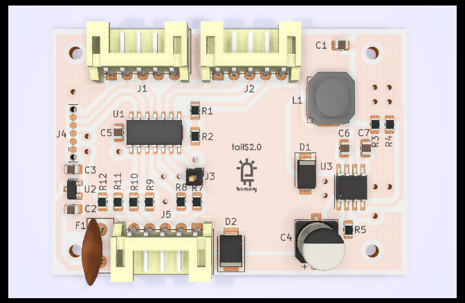
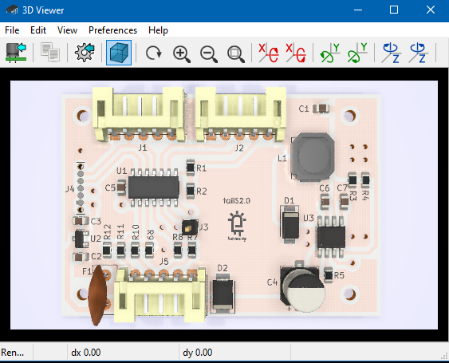
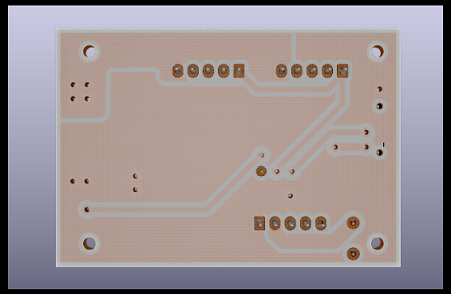
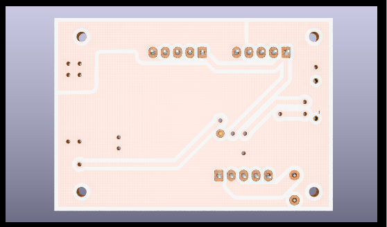

+++
title = "Development Highlight: V6 3D Viewer Improvements"
date = "2020-09-22"
draft = true
"blog/categories" = [
    "Development Highlight"
]
+++

:icons:
:iconsdir: /img/icons/

Not all changes to KiCad have to large by themselves, and this development highlight aims to showcase smaller improvements made 
so far to the 3D Viewer by a few contributors and are available in the nightly builds.
<!--more-->

== Populate Silkscreen and Soldermask Colors from PCBNew board properties
A small quality of life improvement (but appreciated nonetheless 👍), https://gitlab.com/Drinausaur[Fabien Corona] in https://gitlab.com/kicad/code/kicad/-/merge_requests/63[MR#63] added the ability
for the 3D viewer to use the board soldermask and silkscreen colors as defined in PCBNew just like the title of the merge request implies 😀

== Model Opacity
https://gitlab.com/kicad/code/kicad/-/merge_requests/188[MR#188] 
https://gitlab.com/KammutierSpule[Mario Luzeiro] in 

== Rendering Performance Improvement
https://gitlab.com/oleg.endo[Oleg Endo] was unhappy with the rendering performance of the 3D viewer which on his system exhibited 
frames per second rendering times as slow as 10 FPS. After his changes in https://gitlab.com/kicad/code/kicad/-/merge_requests/145[MR#145]
rendering speeds may be up to 8x faster as before.

== Anti aliasing and while moving
https://gitlab.com/KammutierSpule[Mario Luzeiro] in https://gitlab.com/kicad/code/kicad/-/merge_requests/141[MR#141] 

== Lighting improvement with floors
The floor plane object that is optional to add in the 3D Viewer previously cast a shadow onto the bottom side of the board.
https://gitlab.com/burhanemre[Emery Burhan] in https://gitlab.com/kicad/code/kicad/-/merge_requests/170[MR#170] submitted a patch
to disable the casting of shadow by the floor object to give the PCB a more uniform look.

== Configurable View Change Speed
https://gitlab.com/burhanemre[Emery Burhan] in https://gitlab.com/kicad/code/kicad/-/merge_requests/171[MR#171] added the ability to set
an "animation speed" when toggling between board views with hotkeys. 
Now the camera animation speed can be adjusted by a slider.
