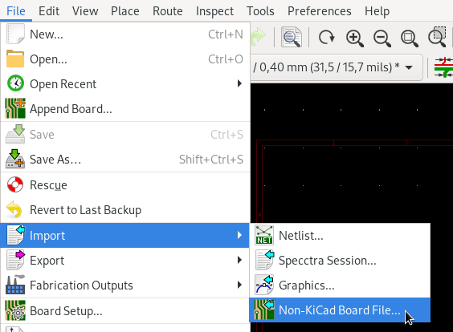
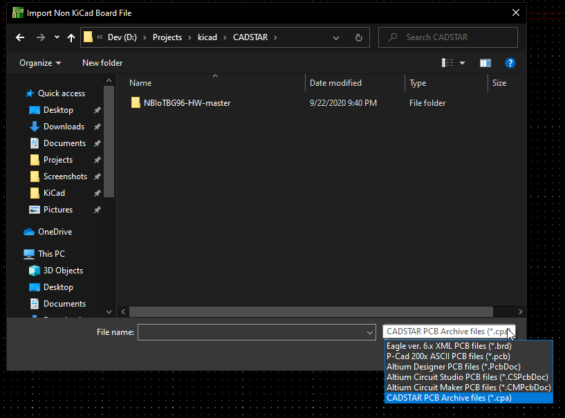
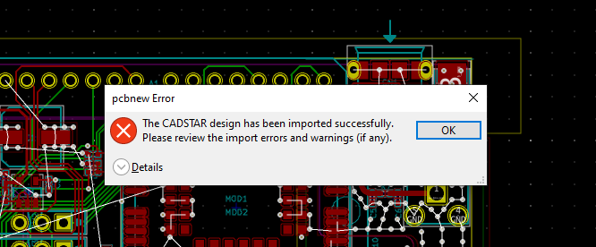
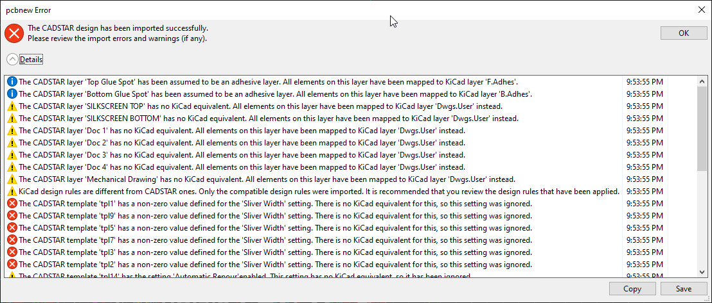
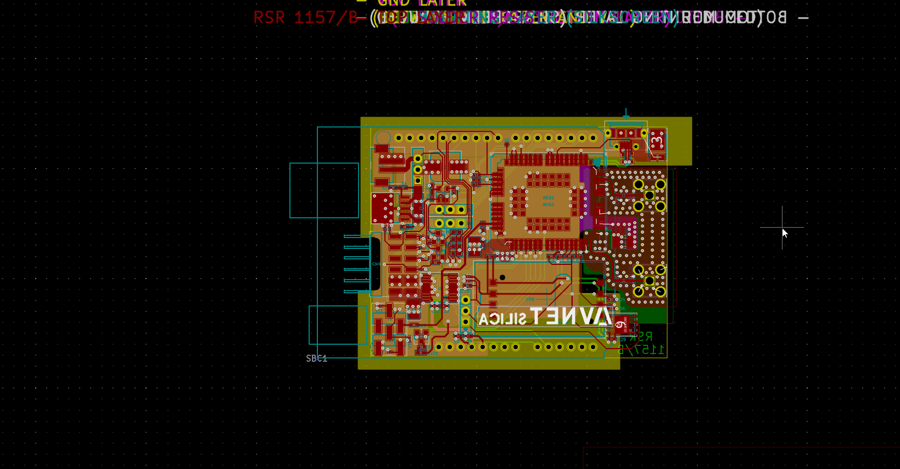

+++
title = "Development Highlight: CADSTAR PCB Importer"
date = "2020-09-22"
draft = false
"blog/categories" = [
    "Development Highlight"
]
+++

:icons:
:iconsdir: /img/icons/

Thanks to the work of https://gitlab.com/Qbort[Roberto Fernandez Bautista] in https://gitlab.com/kicad/code/kicad/-/merge_requests/279[MR#279],
KiCad is now able to import CADSTAR PCB files! 

The board import option can be found under the *_File > Import > Non-Kicad Board File_* option and changing the file type filter

After which in the import file dialog you must change the file filter

After selecting your CPA file and a short delay. Pcbnew will display its best attempt at a import and provide warnings if it had any difficulties importing the file.

Clicking on Details (recommended) will show you any conversion related changes that were made.

In this example, this link:https://github.com/Avnet-Silica-team/NBIoTBG96-HW[Github hosted project] was imported to get the resulting kicad pcb

If you want to give the board import a spin, simply download the latest KiCad nightly. Feel free to link:/help/report-an-issue/[report any issues] you may find.

If you want to join in on a discussion on this feature, you may find a forum thread with the developer link:https://forum.kicad.info/t/work-in-progress-native-cadstar-importer/24665/[here]

NOTE: Both this feature and nightly builds are in development, please only use them for testing and experimentation
