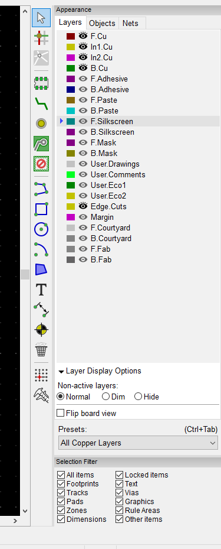
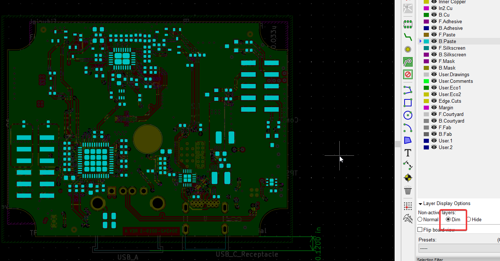
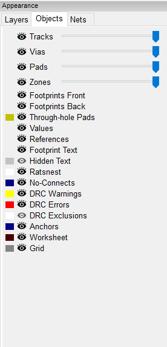
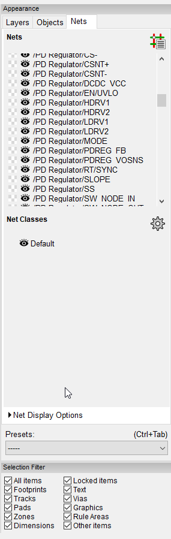
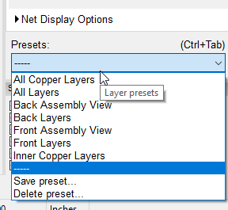
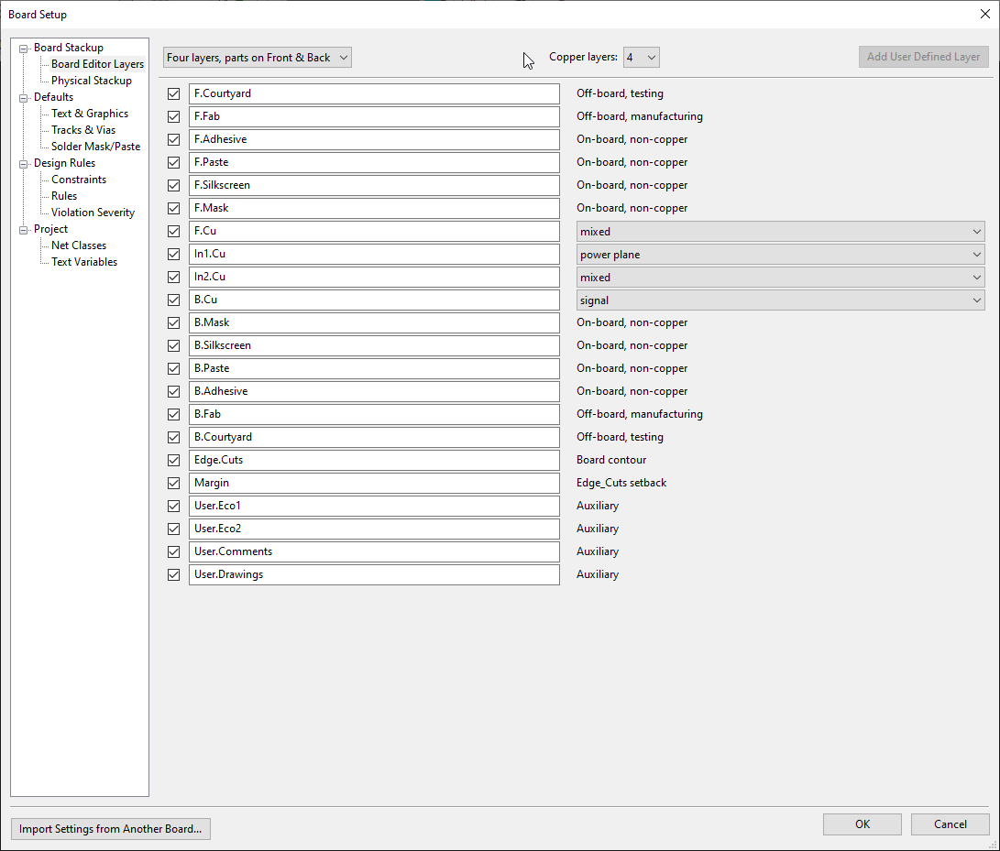
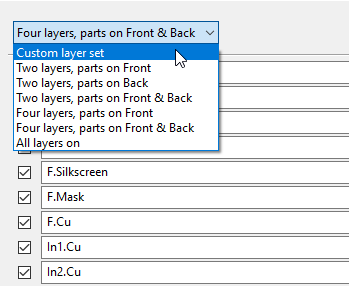
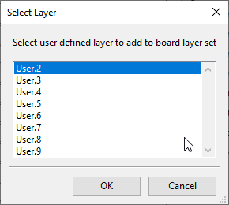
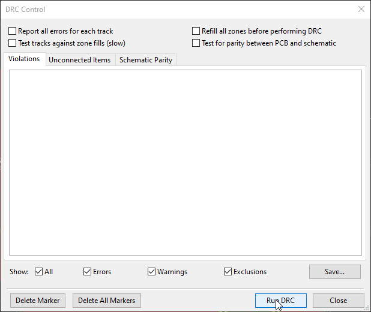
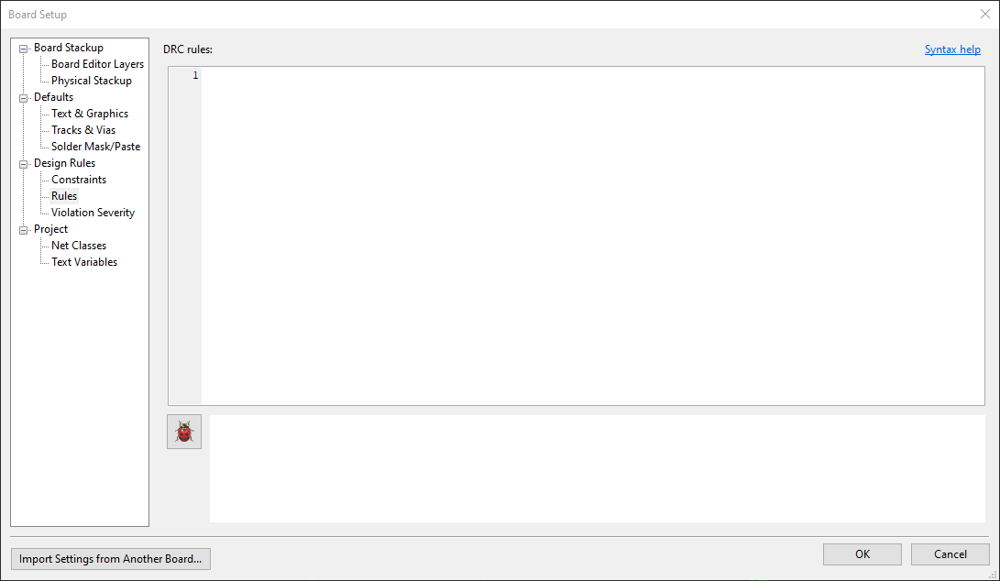

+++
title = "Development Highlight: Layer Management and DRC Improvements"
date = "2020-10-01"
draft = true
"blog/categories" = [
    "Development Highlight"
]
+++

Some great workflow improving changes were made to PCBNew in this Development Highlight for the future KiCad V6 😄

== Layer Management

link:https://gitlab.com/craftyjon[Jon Evan] introduced a brand new Appearance control in link:https://gitlab.com/kicad/code/kicad/-/commit/bd14f8a82a3b006b4f0f9948a70637b08dfa7980[commit bd14f8a82].


The entire *Appearance* control received a visual and functional overhaul



There is now the ability to Show all Layers, dim non-selected layers and hide non-selected layers




Object types also get opacity and visibility control independent of layers



Individual nets and net classes can also have color overrides sets independent of their layer



Finally, there are Layer Presets, which allow you to either use predefined presets or your own to quickly switch layer settings.



== User Layers

link:https://gitlab.com/stambaughw[Wayne Stambaugh] in link:https://gitlab.com/kicad/code/kicad/-/commit/188232de6f7e73b85258ad3782a52eaa6f9fb7f8[commit 188232de6] added the ability to give all layers a custom name and nine new user definable non-copper layers.




Simply set the layer set to custom



And you'll gain the ability to add the new User Layers




== New Design Rule Check (DRC) Engine

Thanks to the work of multiple contributors including link:https://gitlab.com/twlostow[Tomasz Wlostowski], link:https://gitlab.com/jeffyoung[Jeff Young],  and others. The DRC engine and dialog in PCBNew have received an overhaul.

The DRC dialog has received a visual uplift.



As a major part of the DRC engine overhaul, it has been made possible to *script* your own rules which allows for more complex
rules than can be described by a dialog and makes it easier to reuse them across projects.

The *Board Setup* window under File > Board Setup contains the new page to store the rules



Rules look like this

```
(rule HV_HV
   # wider clearance between HV tracks
   (constraint clearance (min "1.5mm + 2.0mm"))
   (condition "A.NetClass == 'HV' && B.NetClass == 'HV'"))
(rule HV_unshielded
   (constraint clearance (min 2mm))
   (condition "A.NetClass == 'HV' && !A.insideArea('Shield*')))
```

More info on the syntax can be found by clicking the Syntax Help link in the Rules page of Board Setup

